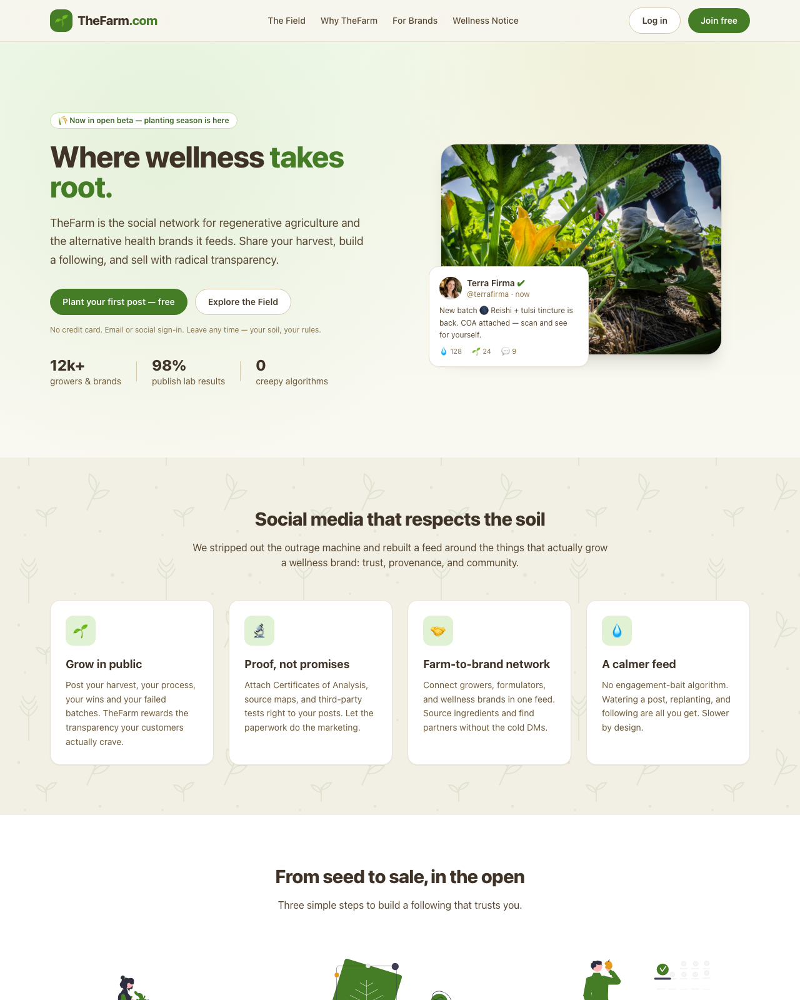
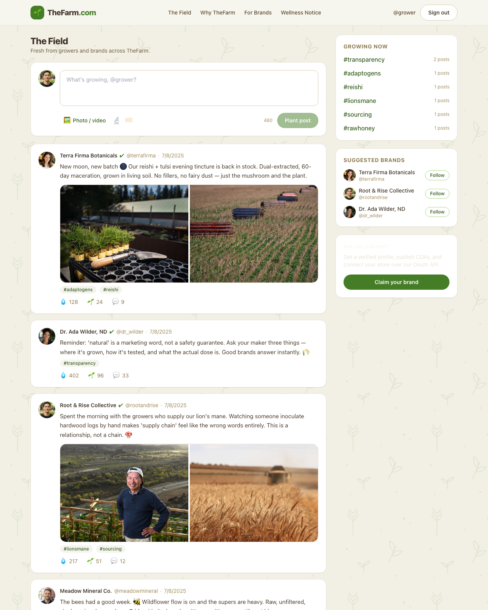

# 🌱 TheFarm.com

**The social network where wellness takes root.** A Twitter-style community for
regenerative agriculture and the alternative-health brands it feeds — built with
Next.js and deployable to Vercel in one click.

TheFarm ships turnkey: **email login works out of the box with zero
configuration**, and Google/GitHub OAuth switch on automatically the moment you
add credentials.

---

## Screenshots

| Landing page | The Field (signed in) |
| :---: | :---: |
| [](docs/screenshot-landing.png) | [](docs/screenshot-feed.png) |
| Hero, live-post preview, and the "social media that respects the soil" feature grid. | The main feed: composer, X-style photo grids, "watering", plus *Growing now* and *Suggested brands*. |

---

## Features

- 🐦 **Twitter-style feed** ("The Field") with composing, "watering" (likes),
  replanting, and replies
- 🔐 **Auth built in** — email/password login *plus* optional Google & GitHub
  OAuth via [NextAuth.js](https://next-auth.js.org/)
- 📷 **Images & video in posts** — attach up to 4 photos or a single video
  clip; previews in the composer, an X-style image grid and an inline video
  player in the feed
- 🎯 **Landing page** with a strong call-to-action, feature sections, and a
  brand-focused pitch
- 📄 **Complete legal suite** — Terms, Privacy Policy, Cookie Policy, and an
  FDA-style Wellness Disclaimer appropriate for alternative-health content
- 🦶 **Believable footer** with sitemap-style link columns and a persistent
  health disclosure
- 🔌 **OAuth-ready** foundation for API integrations
- 🎨 Agriculturally-themed design system (Tailwind CSS), fully responsive
- 🗃️ **No database required** — seeded in-memory store keeps first-run friction
  at zero

---

## Quick start (runs on the first try)

```bash
# 1. Install dependencies
npm install

# 2. (Optional) create your env file — not required for email login
cp .env.local.example .env.local

# 3. Start the dev server
npm run dev
```

Then open **http://localhost:3000**.

### Logging in

Email login works immediately. On the login screen use **any valid email + a
password of at least 6 characters**, for example:

- Email: `grower@thefarm.co`
- Password: `harvest`

> The demo authorizes any well-formed email/password so you can explore without
> setup. Replace the `authorize()` logic in [`lib/auth.js`](lib/auth.js) with a
> real password check against your user store for production.

---

## Sign-in options

Auth is handled by [NextAuth.js](https://next-auth.js.org/). Out of the box you
get **email/password sign-in** (works locally and on Vercel with zero config).
On top of that, TheFarm ships wiring for the mainstream **consumer** social
logins — add a provider's keys and its button appears on the login screen
automatically:

| Provider | Env vars | Callback URL |
| --- | --- | --- |
| **Google** | `GOOGLE_CLIENT_ID` / `GOOGLE_CLIENT_SECRET` | `/api/auth/callback/google` |
| **Apple** | `APPLE_CLIENT_ID` / `APPLE_CLIENT_SECRET` | `/api/auth/callback/apple` |
| **Facebook** | `FACEBOOK_CLIENT_ID` / `FACEBOOK_CLIENT_SECRET` | `/api/auth/callback/facebook` |
| **GitHub** (optional) | `GITHUB_CLIENT_ID` / `GITHUB_CLIENT_SECRET` | `/api/auth/callback/github` |

Setup links and per-provider notes are in
[`.env.local.example`](.env.local.example). A couple of gotchas worth knowing:

- **Apple** requires an Apple Developer account and an HTTPS callback (it won't
  accept `http://localhost`), and its client secret is a JWT you generate from a
  `.p8` key — the most involved of the four. Test it on a deployed URL.
- **Google / Facebook / GitHub** work fine against `http://localhost:3000`.

Adding another provider later (Microsoft, LinkedIn, Twitter/X, Discord…) is a
three-line change — see the registry comment at the top of
[`lib/auth.js`](lib/auth.js).

---

## Deploying to Vercel

1. Push this repo to GitHub/GitLab/Bitbucket.
2. Import it at [vercel.com/new](https://vercel.com/new). Next.js is detected
   automatically — no build config needed.
3. Add environment variables in the Vercel dashboard:
   - `NEXTAUTH_SECRET` — generate with `openssl rand -base64 32` (**required in
     production**)
   - `NEXTAUTH_URL` is set for you by Vercel; override only if you use a custom
     domain.
   - Optionally add any social-login keys (Google, Apple, Facebook, GitHub) —
     see the table above. Point each provider's callback URL at your production
     domain, e.g. `https://your-app.vercel.app/api/auth/callback/google`.
4. Deploy. That's it.

---

## Project structure

```
app/
  page.js                    Landing page (hero, features, CTA)
  login/                     Email + social login
  feed/                      "The Field" — the main app feed
  about/  contact/           Company pages
  legal/                     Terms, Privacy, Cookies, Wellness Disclaimer
  api/
    auth/[...nextauth]/      NextAuth route handler
    posts/                   Feed API (GET/POST) + watering endpoint
components/                  Navbar, Footer, Feed, Composer, PostCard, etc.
lib/
  auth.js                    NextAuth config (email + optional OAuth)
  data.js                    In-memory data store + seed content
```

## Going to production

This starter uses an in-memory store so it runs with zero setup. For real
persistence, swap [`lib/data.js`](lib/data.js) for a database (Neon, Supabase,
Vercel Postgres, PlanetScale, etc.) — every data access is already isolated
behind that module, and the API routes won't need to change.

### Media storage

To stay database-free and run offline on the first try, uploaded images and
video are encoded as **data URLs** and stored inline with the post (caps: ~5 MB
per image, ~25 MB per video, enforced in both the composer and
[`lib/data.js`](lib/data.js)). This is perfect for local dev and demos.

For production, don't ship large media through the API — Vercel serverless
functions cap request bodies at ~4.5 MB. Instead, upload files directly to
object storage and store just the URL on the post:

- [**Vercel Blob**](https://vercel.com/docs/storage/vercel-blob) — client
  uploads (`@vercel/blob/client`) bypass the function body limit entirely.
- Or S3 / Cloudflare R2 / Supabase Storage with a presigned upload URL.

The post shape already carries a `media: [{ type, url, alt, poster? }]` array,
so switching from data URLs to hosted URLs is a drop-in change.

## Credits

Illustrations are from [unDraw](https://undraw.co) by Katerina Limpitsouni,
used under the [unDraw license](https://undraw.co/license) (free for personal
and commercial use, no attribution required — included here as a courtesy).
They are self-hosted in [`public/illustrations/`](public/illustrations/) and
recolored to the brand palette so the app runs fully offline.

### Photos

Agriculture photos in the seed feed are Creative-Commons-Zero / public-domain,
discovered via [Openverse](https://openverse.org) and self-hosted in
[`public/photos/`](public/photos/) (full metadata in
[`public/photos/CREDITS.json`](public/photos/CREDITS.json)). No attribution is
required for CC0 / public-domain works; credited here as a courtesy:

- `hero-harvest.jpg` — landing hero, USDA (`USDAgov`, Public Domain Mark 1.0)
- `field-spring-harvest.jpg` — “Spring Harvest” by mpardo.photo (CC0 1.0)
- `tractor-harvest.webp` — “Tractor harvest, grains, wheat, farm” (CC0 1.0)
- `fresh-produce.jpg` — USDA (`USDAgov`, Public Domain Mark 1.0)
- `greenhouse-seedlings.jpg` — “Glacier's Native Plant Nursery” by GlacierNPS (Public Domain)
- `farm-scene.jpg` — “Aguila Farm, Fallbrook, California” by FarmersGov (Public Domain)
- `field-rows.webp` — “Scenic landscape rows” (CC0 1.0)

The original hand-drawn SVG scene ([`public/samples/honey-harvest.svg`](public/samples/honey-harvest.svg))
is still used as the poster for the sample video.

## Disclaimer

Content in this project (including seed posts) is illustrative. The Wellness
Disclaimer, Terms, and Privacy Policy are provided as reasonable starting
templates and are **not legal advice** — have counsel review them before
launch.

---

Made with 🌾 for growers everywhere.
